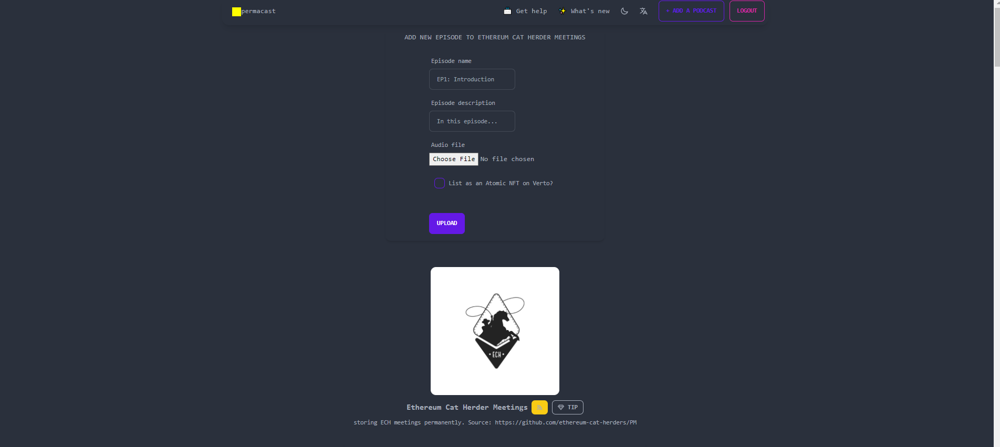

## How To Create A Podcast & Upload Your First Episode

### Creating A Podcast

1- Make sure that you have [Arconnect](https://arconnect.io) installed with enough AR in your wallet. [Tap here to get your first ARs](./getting-ar.md)
2- Head to [permacast.net](https://permacast.net) and login using Arconnect

3- Tap on `ADD A PODCAST` and fill the required podcast's fields

#### Notes (for Permacast V2):
- Podcast's cover should be squared (1:1 aspect ratio)
- Podcast name charater limits: `2 < limit < 51`
- Podcast description character limits: `9 < limit < 751`

### Uploading An Episode

1- As same as `Creating A Podcast` first step.
2- After seeing your podcast on [permacast.net](https://permacast.net), tap on it and scroll down then tap on `ADD A NEW EPISODE`
3- Fill the episode's required fields

### Notes (for Permacast V2):
- Episode name charater limits: `2 < limit < 51`
- Episode description charater limits: `limit < 251`
- Episode audio file should have a `audio/*` MIME type

### Useful links
- [Using Arconnect for the first time](https://arweave.news/how-to-use-arconnect/)
