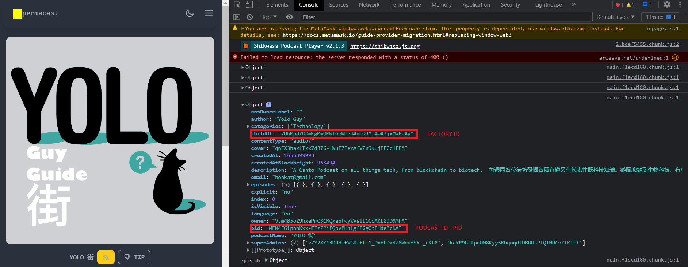

## How To Create A Podcast & Upload Your First Episode (Permacast V3)

The FE interactions stated in [podcast-setup-v2](../podcast-setup-v2.md) apply the same for Permacast V3. However, Permacast V3 introduces a wider flexibility with the charaters limits.

## New V3 limits

### Podcast metadata new limits:
- podcast name limit: 2 <= name <= 500
- podcast description: 10 <= description <= 15000
- author name: 2 <= name <= 150
- categories: 1 <= category <= 300
- language code: code == 2

### Episode metadata new limits:
- episode name: 3 <= name <= 500
- episode description: 1 <= description <= 5000

## From scratch:

#### prerequisite
```sh
npm install arweave
``` 

### Creating a podcast



```js
// initialize Arweave

import Arweave from "arweave";

const arweave = Arweave.init({
  host: "arweave.net",
  protocol: "https",
  port: 443,
  timeout: 60000,
  logging: false,
});

const FACTORY_ID = "..."; // the SWC id of your deployed factory (`childOd`)
const PK = JSON.stringify(YOUR_JWK_OBJECT);
const PODCAST_DESCRIPTION = `your podcast description`;

const interaction = {
  function: "createPodcast",
  name: "audible sea",
  contentType: "a", // 'a'stands for audio
  author: "Darwin",
  email: "",
  lang: "en",
  isExplicit: "no",
  categories: "Art",
  cover: "adEFto5MEJYeeOqRFL9k6aCB8qq6OsA-526u6GvWGZY",
};

async function createPodcast() {
  try {
    const tx = await arweave.createTransaction(
      {
        data: PODCAST_DESCRIPTION,
      },
      pk
    );

    tx.addTag("App-Name", "SmartWeaveAction");
    tx.addTag("App-Version", "0.3.0");
    tx.addTag("Contract", FACTORY_ID);
    tx.addTag("Permacast-Version", "amber");
    tx.addTag("Input", JSON.stringify(interaction));
    tx.addTag("Content-Type", "text/plain");

    await arweave.transactions.sign(tx, pk);
    await arweave.transactions.post(tx);

    console.log(`podcast created: ${tx.id}`);

    return tx?.id;
  } catch (error) {
    console.log(error);
  }
}

```

### Uploading an episode: 

```js
// initialize Arweave

import Arweave from "arweave";

const arweave = Arweave.init({
  host: "arweave.net",
  protocol: "https",
  port: 443,
  timeout: 60000,
  logging: false,
});

const FACTORY_ID = "..."; // the SWC id of your deployed factory
const PID = "..." // the podcast ID (PID)
const PK = JSON.stringify(YOUR_JWK_OBJECT);
const EPISODE_DESCRIPTION = `your episode description`;

const interaction = {
  function: "addEpisode",
  pid: PID,
  desc: true,
  name: "episode #1",
  content: "THE-AUDIO-FILE-TXID",
};


async function uploadEpisode() {
  try {
    const tx = await arweave.createTransaction(
      {
        data: EPISODE_DESCRIPTION,
      },
      pk
    );

    tx.addTag("App-Name", "SmartWeaveAction");
    tx.addTag("App-Version", "0.3.0");
    tx.addTag("Contract", FACTORY_ID);
    tx.addTag("Permacast-Version", "amber");
    tx.addTag("Input", JSON.stringify(interaction));
    tx.addTag("Content-Type", "text/plain");

    await arweave.transactions.sign(tx, pk);
    await arweave.transactions.post(tx);

    console.log(`episode uploaded: ${tx.id}`);

    return tx?.id;
  } catch (error) {
    console.log(error);
  }
}

```
